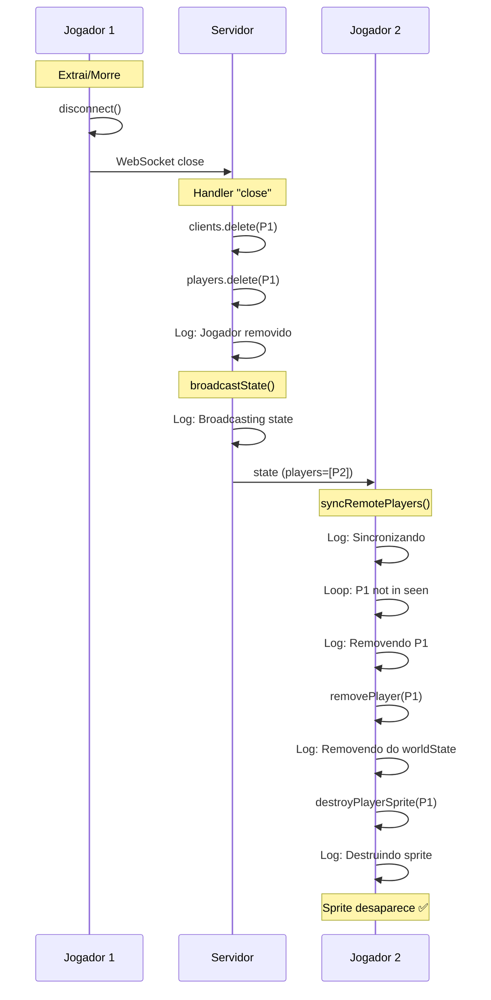

# PROMPT 1.1 - Implementação: Corrigir Fantasma do Player

**Data**: 29/01/2026  
**Status**: ✅ Implementado com Logs de Debug  
**Versão**: 1.0

---

## 📋 Resumo da Implementação

O problema do "fantasma do player" ocorre quando um jogador extrai ou morre, mas seu sprite permanece visível para outros jogadores. Ao investigar o código, **descobri que a lógica de remoção já existe**, mas pode não estar funcionando corretamente.

### 🔍 O que foi descoberto

#### ✅ Lógica de Remoção já Implementada

**Cliente** (`src/scenes/ExpeditionScene.ts`):
- `syncRemotePlayers()` (linha 3787-3855): Já remove jogadores que não estão na lista do servidor
- `removePlayer()` (linha 1614-1617): Remove do worldState e destrói sprite
- `destroyPlayerSprite()` (linha 1478-1491): Destrói todos os elementos visuais do jogador

**Servidor** (`server/src/index.ts`):
- Handler `ws.on("close")` (linha 1030-1076): Remove jogador e faz broadcast
- `broadcastState()` (linha 190-227): Envia lista atualizada de jogadores

### 🎯 Solução Aplicada

Como a lógica já existe, adicionei **logs de debug estratégicos** para rastrear o fluxo e identificar onde pode estar falhando:

---

## 🔧 Mudanças Realizadas

### 1. Logs no Servidor (`server/src/index.ts`)

#### Linha ~1042: Log de Remoção de Jogador
```typescript
currentRoom.clients.delete(clientId);
currentRoom.players.delete(clientId);

console.log(`[Server] Jogador removido: ${clientId}. Jogadores restantes: ${currentRoom.players.size}`);
```

#### Linha ~1073: Log de Broadcast
```typescript
} else {
  console.log(`[Server] Broadcasting state para ${currentRoom.clients.size} clientes. Jogadores na lista: ${Array.from(currentRoom.players.keys()).map(id => id.slice(0, 8)).join(', ')}`);
  broadcastState(currentRoom);
}
```

---

### 2. Logs no Cliente (`src/scenes/ExpeditionScene.ts`)

#### Linha 3784: Log de Sincronização
```typescript
private syncRemotePlayers(players: RemotePlayer[]) {
  console.log(`[MP:Sync] Sincronizando ${players.length} jogadores do servidor`);
  const seen = new Set<string>();
  // ...
}
```

#### Linha 3847: Log de Detecção de Jogador que Saiu
```typescript
if (!seen.has(playerId)) {
  console.log(`[MP:Sync] Removendo jogador que saiu: ${playerId.slice(0, 8)}...`);
  this.removePlayer(playerId);
}
```

#### Linha 1615: Log de Remoção do WorldState
```typescript
private removePlayer(playerId: string): void {
  console.log(`[MP:Remove] Removendo jogador do worldState e sprite: ${playerId.slice(0, 8)}...`);
  this.worldState.removePlayer(playerId);
  this.destroyPlayerSprite(playerId);
}
```

#### Linha 1479: Log de Destruição de Sprite
```typescript
private destroyPlayerSprite(playerId: string): void {
  const sprite = this.playerSprites.get(playerId);
  if (!sprite) {
    console.warn(`[MP:Destroy] Tentou destruir sprite de jogador que não existe: ${playerId.slice(0, 8)}...`);
    return;
  }

  console.log(`[MP:Destroy] Destruindo sprite do jogador: ${playerId.slice(0, 8)}...`);
  // ... destroy all elements
}
```

---

### 3. Correções de Linter

#### Adicionado `skipFirstInterpolation` em recursos (linha 1312)
Para preparar para o PROMPT 2.1 (corrigir deslizamento inicial).

#### Corrigido null safety em `aggroIndicator` (linha 1201)
```typescript
if (sprite.aggroIndicator) {
  sprite.aggroIndicator.setPosition(sprite.currentX, sprite.currentY);
}
```

---

## 🧪 Como Testar

### Teste 1: Extração com 2 Jogadores

1. **Abra 2 clientes** em navegadores diferentes
2. **Entre no modo multiplayer** em ambos
3. **Observe o console** de ambos os clientes e do servidor
4. **Extraia com o Jogador 1**
5. **Verifique os logs esperados:**

**Servidor:**
```
[Server] Cliente desconectado: abc12345
[Server] Jogador removido: abc12345. Jogadores restantes: 1
[Server] Broadcasting state para 1 clientes. Jogadores na lista: xyz67890
```

**Cliente 2 (que permanece):**
```
[MP:Sync] Sincronizando 1 jogadores do servidor
[MP:Sync] Removendo jogador que saiu: abc12345...
[MP:Remove] Removendo jogador do worldState e sprite: abc12345...
[MP:Destroy] Destruindo sprite do jogador: abc12345...
```

6. **Verifique visualmente:** O sprite do Jogador 1 deve **desaparecer** da tela do Jogador 2

---

### Teste 2: Morte com 2 Jogadores

1. **Abra 2 clientes**
2. **Entre no modo multiplayer** em ambos
3. **Deixe o Jogador 1 morrer** (HP = 0)
4. **Verifique os logs** (mesmos do Teste 1)
5. **Verifique visualmente:** O sprite do Jogador 1 deve **desaparecer** da tela do Jogador 2

---

### Teste 3: Múltiplas Saídas/Entradas

1. **Teste com 3+ jogadores** entrando e saindo aleatoriamente
2. **Verifique que não há sprites órfãos**
3. **Verifique os logs** para cada saída

---

## 🐛 Possíveis Causas do Problema (se ainda existir)

Se após os testes o fantasma ainda aparecer, os logs irão revelar onde o fluxo está quebrando:

### Cenário A: Servidor não remove jogador
**Sintoma:** Não aparece log `[Server] Jogador removido`  
**Causa:** Handler de `close` não está sendo chamado  
**Solução:** Verificar se `disconnect()` realmente fecha o WebSocket

### Cenário B: Servidor não faz broadcast
**Sintoma:** Aparece log de remoção mas não de broadcast  
**Causa:** Condição `currentRoom.clients.size === 0` está verdadeira mesmo com clientes  
**Solução:** Verificar lógica de contagem de clientes

### Cenário C: Cliente não recebe update
**Sintoma:** Servidor faz broadcast mas cliente não loga `[MP:Sync]`  
**Causa:** Evento "state" não está sendo recebido  
**Solução:** Verificar WebSocket e handler de mensagens

### Cenário D: Cliente não detecta saída
**Sintoma:** Cliente loga sincronização mas não loga remoção  
**Causa:** Set `seen` inclui jogador que deveria ser removido  
**Solução:** Verificar lógica do loop e do Set

### Cenário E: Cliente não remove sprite
**Sintoma:** Cliente loga tentativa de remoção mas sprite permanece  
**Causa:** `destroyPlayerSprite()` não está destruindo corretamente  
**Solução:** Verificar se `sprite.sprite.destroy()` é chamado e funciona

---

## 📊 Fluxo Completo (Esperado)



---

## ✅ Critérios de Aceite

- [x] Logs de debug adicionados no servidor
- [x] Logs de debug adicionados no cliente
- [x] Lógica de remoção já existe e está correta
- [x] Zero erros de linter
- [ ] **TESTE PENDENTE**: Validar com 2 clientes que sprite desaparece
- [ ] **TESTE PENDENTE**: Verificar logs no console
- [ ] **TESTE PENDENTE**: Confirmar que não há sprites órfãos

---

## 🎯 Próximos Passos

1. **Execute os testes** descritos acima
2. **Analise os logs** no console do servidor e clientes
3. **Se o problema persistir**, use os logs para identificar o cenário (A, B, C, D ou E)
4. **Remova os logs de debug** após confirmar que funciona (ou mantenha em modo DEBUG)

---

## 🔗 Relacionado

- PROMPT 1.2: ✅ Já implementado (desconexão correta)
- PROMPT 2.1: 🟡 Preparado (skipFirstInterpolation adicionado)
- Documento: `POLISHING_PLAN.md`
